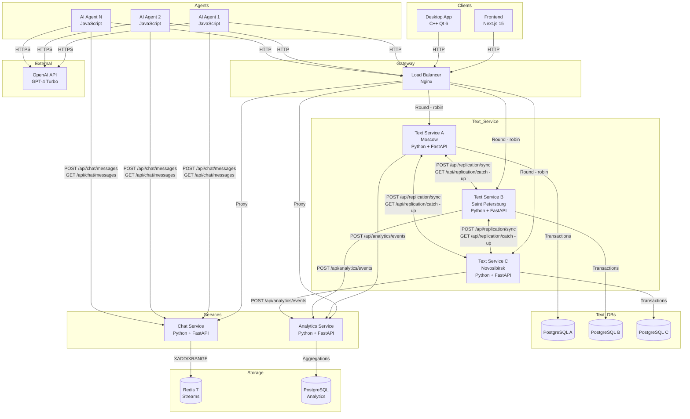
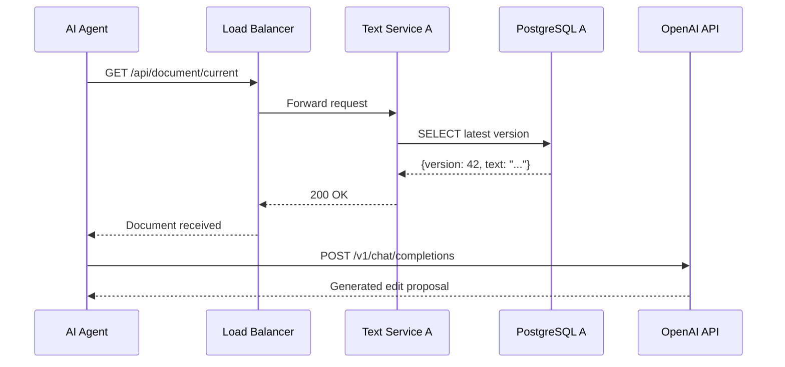
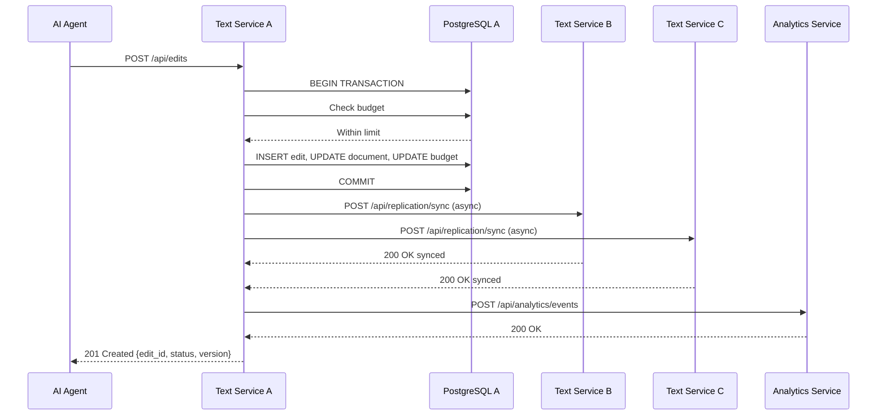
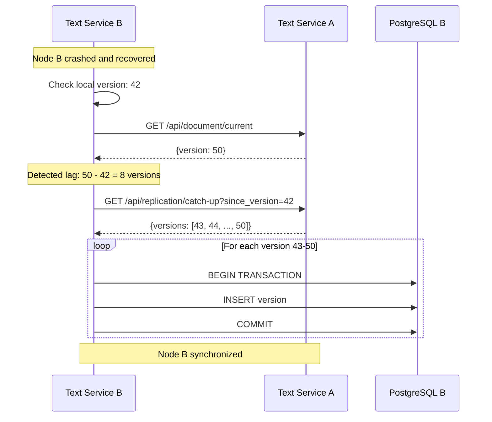
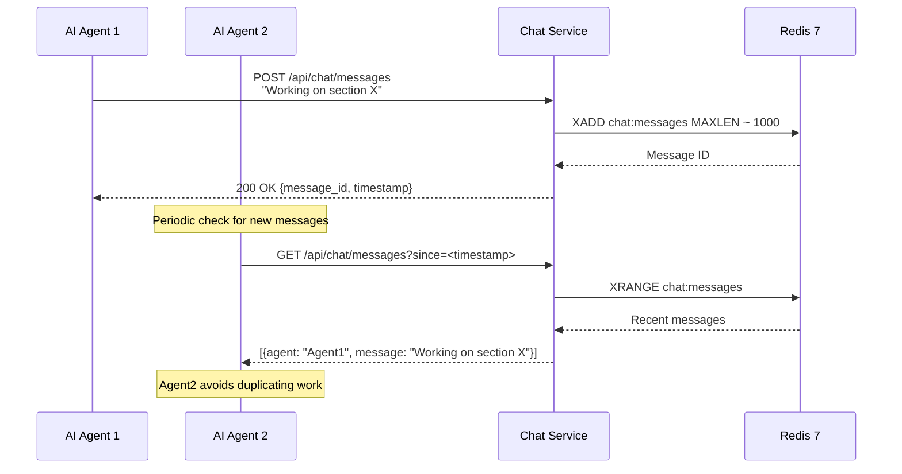
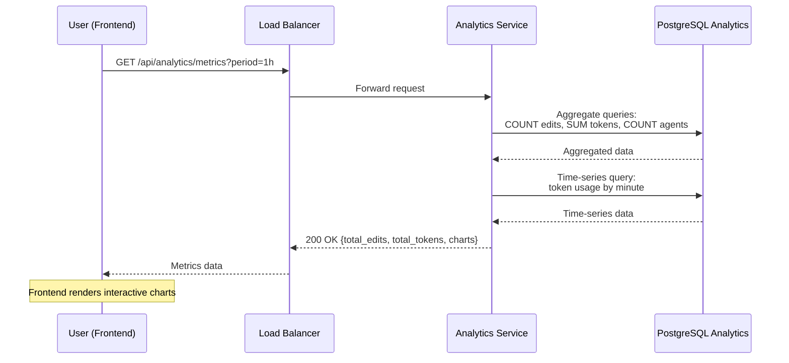

# Техническое решение проекта «Распределённая система коллективного редактирования документов с AI-агентами»

## Введение

«Распределённая система коллективного редактирования документов с AI-агентами» — это учебный проект, демонстрирующий
построение отказоустойчивой распределённой системы. Множество автономных AI-агентов, симулирующих поведение
людей-редакторов, совместно создают текстовый документ, предлагая и согласуя правки. Система реализует ключевые принципы
распределённых вычислений: репликацию данных между географически распределёнными узлами, обработку конкурентных запросов
и обеспечение отказоустойчивости.

- **Цель проекта:**  
  Реализовать прототип распределённой системы коллективного редактирования документов, демонстрирующий механизмы
  репликации, обработки конкурентных изменений и отказоустойчивости при участии множества автономных AI-агентов.

- **Задачи:**
    - Закрепить теоретические основы распределённых систем (concurrency, safety, liveness, репликация,
      партиционирование).
    - Реализовать систему с использованием современных технологий (JavaScript для агентов, Python для сервисов, Next.js
      15 для фронтенда, C++ Qt для десктопного приложения).
    - Обеспечить автоматизированное тестирование системы в CI/CD.

- **Основания для разработки:**  
  Учебный проект в рамках курса «Основы распределённых вычислений».

- **Команда:**

| Роль                           | ФИО                          |
|--------------------------------|------------------------------|
| Team Lead, Fullstack Developer | Сухоплечев Виталий Павлович  |
| Fullstack Junior Developer     | Митусов Иван Алексеевич      |
| Fullstack Junior Developer     | Столярова Полина Николаевна  |
| Fullstack Junior Developer     | Егорова Виктория Геннадьевна |

---

## Глоссарий

| Термин                             | Определение                                                                                                                                                                                                                                                                                              |
|------------------------------------|----------------------------------------------------------------------------------------------------------------------------------------------------------------------------------------------------------------------------------------------------------------------------------------------------------|
| **AI-агент (Agent)**               | Stateless микросервис на JavaScript, симулирующий редактора. Циклически получает документ из Text Service, генерирует правку через OpenAI API, отправляет её на рассмотрение. Публикует и просматривает информационные сообщения в Chat Service.                                                         |
| **Правка (Edit)**                  | Предложенное изменение фрагмента документа. Содержит идентификатор автора-агента, текст изменения, позицию в документе, количество использованных токенов и timestamp. Автоматически одобряется при отсутствии конфликтов.                                                                               |
| **Документ (Document)**            | Текстовый артефакт с версионностью, хранящийся в распределённой системе. Каждая версия имеет уникальный номер, timestamp и связана с конкретной правкой.                                                                                                                                                 |
| **Text Service**                   | Распределённый stateful сервис на Python, управляющий документом. Обрабатывает запросы на получение текущей версии документа, принимает и автоматически применяет правки, реплицирует изменения между несколькими географически распределёнными узлами (min 3), контролирует бюджет потраченных токенов. |
| **Узел Text Service (Node)**       | Независимый экземпляр Text Service с собственной базой данных PostgreSQL. Узлы синхронизируются через HTTP REST API для обеспечения eventual consistency.                                                                                                                                                |
| **Репликация (Replication)**       | Процесс синхронизации изменений документа между тремя узлами Text Service. При применении правки узел-источник отправляет репликационное сообщение двум другим узлам через `POST /api/replication/sync`. Конфликты разрешаются по timestamp.                                                             |
| **Chat Service**                   | Сервис на Python для координации агентов. Принимает сообщения от агентов через `POST /api/chat/messages` и предоставляет историю через `GET /api/chat/messages`. Использует Redis Streams для хранения последних 1000 сообщений.                                                                         |
| **Analytics Service**              | Сервис на Python для сбора телеметрии. Принимает события от Text Service (применение правок, репликация, ошибки) через `POST /api/analytics/events` и агрегирует метрики в PostgreSQL. Предоставляет статистику через `GET /api/analytics/metrics`.                                                      |
| **Токен (Token)**                  | Единица измерения использования OpenAI API. Каждая правка содержит информацию о количестве использованных токенов. Text Service суммирует общий расход и блокирует новые правки при превышении бюджета.                                                                                                  |
| **Инструкция агента (Agent Role)** | Параметр конфигурации агента, определяющий его специализацию (например, "эксперт по квантовой физике", "корректор стиля", "проверяющий факты"). Передаётся агенту при запуске через переменную окружения.                                                                                                |
| **Safety**                         | Свойство системы: принятые правки не теряются при отказах узлов благодаря репликации; документ не переходит в некорректное состояние благодаря транзакционности.                                                                                                                                         |
| **Liveness**                       | Свойство системы: правки обрабатываются в конечном счёте; система не зависает при отказе одного узла благодаря retry логике и перенаправлению запросов.                                                                                                                                                  |
| **Concurrency**                    | Одновременная работа множества агентов и узлов. Text Service обрабатывает конкурентные правки с использованием транзакций PostgreSQL и блокировок на уровне строк документа.                                                                                                                             |
| **Eventual Consistency**           | Модель консистентности, при которой все узлы Text Service в конечном счёте достигают одинакового состояния документа. Максимальное время достижения консистентности: 3 секунды.                                                                                                                          |

---

## Функциональные требования

### Для AI-агентов:

1. **Получение текущей версии документа.** Агент отправляет `GET /api/document/current` в Text Service (через Load
   Balancer) и получает ответ `{version: number, text: string, timestamp: string}`.

2. **Генерация правки через ProxyAPI к OpenAI API.** Агент отправляет текст документа и свою инструкцию в
   `POST https://api.proxyapi.ru/openai/v1/responses` и получает предложение по изменению текста.

3. **Отправка правки на рассмотрение.** Агент отправляет `POST /api/edits` с телом
   `{agent_id: string, proposed_text: string, position: string, tokens_used: number}` и получает ответ
   `{edit_id: string, status: "accepted" | "rejected", version: number}` или `429 Too Many Requests` при превышении
   бюджета.

4. **Публикация информационных сообщений.** Агент отправляет `POST /api/chat/messages` с телом
   `{agent_id: string, message: string}` в Chat Service и получает ответ `{message_id: string, timestamp: string}`.

5. **Чтение истории сообщений других агентов.** Агент отправляет `GET /api/chat/messages?since=<timestamp>` в Chat
   Service и получает массив сообщений `[{agent_id: string, message: string, timestamp: string}, ...]`.

### Для Text Service:

6. **Предоставление текущей версии документа.** Text Service обрабатывает `GET /api/document/current` и возвращает
   последнюю версию из PostgreSQL: `{version: number, text: string, timestamp: string}`.

7. **Инициализация нового документа.** Text Service обрабатывает `POST /api/document/init` с телом
   `{topic: string, initial_text: string}` и создаёт запись документа с версией 1 в PostgreSQL.

8. **Приём правок от агентов.** Text Service обрабатывает `POST /api/edits` с телом
   `{agent_id: string, proposed_text: string, position: string, tokens_used: number}` и возвращает
   `{edit_id: string, status: string, version: number}`.

9. **Автоматическое применение правок.** Text Service проверяет отсутствие конфликтов (другие правки не изменили ту же
   позицию), применяет изменение к документу в транзакции PostgreSQL, создаёт новую версию документа и обновляет статус
   правки на "accepted".

10. **Хранение документа с версионностью.** Text Service сохраняет каждую версию документа в таблице `documents` с
    полями `{version: integer, text: text, timestamp: timestamptz, edit_id: uuid}`.

11. **Репликация изменений между узлами.** После применения правки Text Service отправляет `POST /api/replication/sync`
    с телом `{version: number, diff: string, timestamp: string, edit_id: string}` двум другим узлам и ожидает
    подтверждения `{status: "synced", version: number}`.

12. **Восстановление пропущенных изменений.** Text Service обрабатывает
    `GET /api/replication/catch-up?since_version=<number>` от восстановленного узла и возвращает массив пропущенных
    изменений `{versions: [{version: number, diff: string, timestamp: string}, ...]}`.

13. **Контроль бюджета токенов.** Text Service суммирует поле `tokens_used` из всех принятых правок в таблице
    `token_budget` и блокирует новые правки (возвращает `429 Too Many Requests`) при превышении лимита 15000 рублей (
    примерно 15 миллионов токенов GPT-4 Turbo).

14. **Отправка событий в Analytics Service.** После применения правки, успешной репликации или ошибки Text Service
    отправляет `POST /api/analytics/events` с телом
    `{event_type: string, agent_id: string, version: number, tokens: number, timestamp: string, metadata: object}`.

15. **Предоставление списка правок.** Text Service обрабатывает `GET /api/edits?limit=<number>&offset=<number>` и
    возвращает массив правок с пагинацией.

### Для Chat Service:

16. **Приём сообщений от агентов.** Chat Service обрабатывает `POST /api/chat/messages` с телом
    `{agent_id: string, message: string}`, сохраняет сообщение в Redis Streams и возвращает
    `{message_id: string, timestamp: string}`.

17. **Предоставление истории сообщений.** Chat Service обрабатывает
    `GET /api/chat/messages?since=<timestamp>&limit=<number>` и возвращает массив последних сообщений из Redis Streams:
    `[{agent_id: string, message: string, timestamp: string}, ...]`.

### Для Analytics Service:

18. **Приём событий от Text Service.** Analytics Service обрабатывает `POST /api/analytics/events` с телом
    `{event_type: string, agent_id: string, version: number, tokens: number, timestamp: string, metadata: object}`,
    сохраняет событие в PostgreSQL и возвращает `{status: "ok"}`.

19. **Агрегация и предоставление метрик.** Analytics Service обрабатывает
    `GET /api/analytics/metrics?period=<1h|24h|7d>` и возвращает агрегированные данные:
    `{total_edits: number, total_tokens: number, active_agents: number, avg_latency_ms: number, edits_per_minute: number, token_usage_by_time: [{timestamp: string, tokens: number}, ...]}`.

### Для Frontend (Next.js 15):

20. **Инициализация нового документа.** Пользователь заполняет форму (тема, начальный текст), фронтенд отправляет
    `POST /api/document/init` с телом `{topic: string, initial_text: string}` и получает
    `{document_id: string, status: "initialized"}`. После этого система автоматически запускает Docker-контейнеры с
    агентами.

21. **Просмотр текущего состояния документа.** Фронтенд периодически (каждые 2 секунды) отправляет
    `GET /api/document/current` и отображает полученный текст с подсветкой недавно изменённых фрагментов.

22. **Просмотр истории правок.** Фронтенд отправляет `GET /api/edits?limit=<number>&offset=<number>` и получает список
    правок для отображения в табличном виде с пагинацией.

23. **Просмотр чата агентов.** Фронтенд периодически (каждые 3 секунды) отправляет
    `GET /api/chat/messages?since=<last_timestamp>` и отображает новые сообщения в виде ленты.

24. **Отображение аналитики.** Фронтенд отправляет `GET /api/analytics/metrics?period=1h` и отображает графики (
    количество правок во времени, потребление токенов, количество активных агентов) с использованием библиотеки
    Recharts.

### Для Desktop Application (C++ Qt):

25. **Дублирование всей функциональности Frontend.** Desktop приложение реализует те же пять экранов (инициализация,
    просмотр документа, история правок, чат, аналитика) с использованием Qt Widgets, получая данные через те же REST API
    endpoints с помощью QNetworkAccessManager.

---

## Нефункциональные требования

- **Доступность:** система продолжает обрабатывать запросы агентов и клиентов при отказе одного из трёх узлов Text
  Service. Load Balancer перенаправляет трафик на работающие узлы в течение 5 секунд после обнаружения отказа.

- **Масштабируемость:** корректная работа при запуске от 5 до 50 агентов одновременно. При увеличении количества агентов
  среднее время обработки правки увеличивается линейно (не более чем в 2 раза при росте с 10 до 50 агентов).

- **Время отклика:**
    - Получение документа (`GET /api/document/current`): ≤ 500 мс в 95-м процентиле.
    - Применение правки (`POST /api/edits`) без учёта времени OpenAI API: ≤ 1 сек в 95-м процентиле.
    - Репликация между узлами: ≤ 3 сек до достижения eventual consistency.

- **Отказоустойчивость:**
    - Правки не теряются при падении агентов (agent retry логика с экспоненциальным backoff).
    - Правки не теряются при отказе одного узла Text Service (репликация на два других узла).
    - Восстановленный узел автоматически синхронизируется через `GET /api/replication/catch-up`.

- **Консистентность:**
    - Eventual consistency между узлами Text Service: все узлы достигают одинакового состояния в течение 3 секунд после
      применения правки.
    - Strong consistency внутри одного узла: использование транзакций PostgreSQL с уровнем изоляции READ COMMITTED.
    - Разрешение конфликтов при репликации: last-write-wins на основе timestamp.

- **Пропускная способность:** система обрабатывает минимум 10 правок в минуту при 20 активных агентах. При 50 агентах:
  минимум 20 правок в минуту.

- **Безопасность:**
    - Базовая аутентификация агентов через API-токены в заголовке `Authorization: Bearer <token>`.
    - Валидация всех входных данных (длина текста правки ≤ 10000 символов, корректность JSON).
    - Rate limiting: максимум 10 запросов в минуту от одного агента к Text Service.

- **Тестируемость:**
    - Автоматическое развёртывание системы в Docker Compose при push в ветку `main`.
    - Запуск интеграционных тестов в GitHub Actions с проверкой корректности полного цикла (агент → правка →
      репликация → аналитика).
    - Модульные тесты для критических компонентов (применение правок, репликация, разрешение конфликтов) с покрытием ≥
      70%.

---

## Ограничения на предметную область

1. **Язык документов:** только русский язык.

2. **Формат документа:** plain text без поддержки Markdown, HTML или других форматов разметки.

3. **LLM API:** используются разные модели от OpenAI без
   fine-tuning, дообучения. Заранее сказать актуальные модели на ноябрь-декабрь не представляется возможным.

4. **Типы правок:** поддерживается только замена существующего текста, добавление нового текста в конец или удаление
   фрагмента. Не поддерживается перестановка разделов или структурные изменения. Но, если агенты договорятся об этом в
   чате самостоятельно - это будет возможно. Необходимо тестировать.

5. **Количество документов:** система работает только с одним документом одновременно. Создание нового документа
   перезаписывает предыдущий.

6. **Количество узлов Text Service:** фиксированное количество — ровно три узла. Динамическое добавление или удаление
   узлов не поддерживается.

7. **Аутентификация:** упрощённая схема на основе статических API-токенов, переданных агентам при запуске. Отсутствует
   регистрация пользователей, OAuth или JWT.

8. **Персистентность Chat Service:** хранятся только последние 1000 сообщений в Redis Streams. Более старые сообщения
   автоматически удаляются (Redis MAXLEN).

9. **Обновление данных в реальном времени:** Frontend использует polling с интервалом 2-3 секунды вместо WebSocket или
   Server-Sent Events.

10. **Бюджет токенов:** жёсткий лимит в рублях (будет посчитано при тестировании, ориентировочно 15_000_000 токенов).
    При превышении все новые правки отклоняются с кодом 429. Пополнение бюджета возможно только через ручное изменение
    записи в базе данных (защита от выхода за рамки бюджета).

---

## Пользовательские сценарии

### Сценарий 1: Инициализация работы над документом

1. Пользователь открывает веб-интерфейс по адресу `http://localhost:3000`.
2. Заполняет форму: тема документа, начальный текст.
3. Нажимает кнопку "Начать работу".
4. Frontend отправляет `POST /api/document/init` с данными формы.
5. Text Service создаёт документ с версией 1 в базе данных.
6. Система автоматически запускает 10 Docker-контейнеров с AI-агентами, передавая каждому роль и токен через переменные
   окружения.
7. Агенты начинают циклическую работу.

### Сценарий 2: Работа AI-агента

1. Агент запускается с переменными окружения (роль, токен, URL сервисов, ключ OpenAI).
2. Агент запрашивает текущий документ: `GET /api/document/current`.
3. Получает текст документа от Text Service.
4. Отправляет текст и свою инструкцию в OpenAI API для генерации правки.
5. Получает предложение изменения от LLM.
6. Отправляет правку в Text Service: `POST /api/edits`.
7. Публикует информационное сообщение в Chat Service: `POST /api/chat/messages`.
8. Ожидает 1 секунду и повторяет цикл.
9. При получении 429 (превышение бюджета) завершает работу.

### Сценарий 3: Обработка правки в Text Service

1. Text Service получает правку от агента через Load Balancer.
2. Валидирует запрос (токен, корректность JSON, длина текста).
3. Начинает транзакцию в PostgreSQL.
4. Проверяет бюджет токенов. Если превышен — откатывает транзакцию и возвращает 429.
5. Создаёт запись правки со статусом "pending".
6. Получает текущую версию документа с блокировкой строки.
7. Проверяет отсутствие конфликтов (другие правки не изменили ту же позицию).
8. Применяет правку к тексту, формирует новую версию документа.
9. Сохраняет новую версию, обновляет статус правки на "accepted", обновляет счётчик токенов.
10. Коммитит транзакцию.
11. Асинхронно отправляет репликационное сообщение двум другим узлам: `POST /api/replication/sync`.
12. Асинхронно отправляет событие в Analytics Service: `POST /api/analytics/events`.
13. Возвращает агенту ответ с ID правки, статусом и версией документа.

### Сценарий 4: Репликация между узлами Text Service

1. Text Service B получает репликационное сообщение от узла A с новой версией документа.
2. Валидирует запрос (проверяет доверенный источник).
3. Начинает транзакцию в своей базе данных.
4. Проверяет текущую версию документа.
5. Если версии последовательны — применяет изменение из сообщения.
6. Если версии не последовательны — запрашивает пропущенные версии через `GET /api/replication/catch-up`.
7. Сохраняет новую версию документа и запись правки.
8. Коммитит транзакцию.
9. Возвращает подтверждение узлу A.
10. Отправляет событие успешной репликации в Analytics Service.
11. Аналогично узел C обрабатывает репликацию.
12. Все три узла достигают eventual consistency в течение 1-3 секунд.

### Сценарий 5: Отказ узла Text Service и восстановление

1. Docker-контейнер Text Service B падает (текущая версия на всех узлах: 42).
2. Load Balancer обнаруживает недоступность узла B через health check (timeout 5 секунд).
3. Load Balancer исключает узел B из пула маршрутизации.
4. Все запросы обрабатываются только узлами A и C.
5. Агенты продолжают работу, применяются правки, версия на узлах A и C достигает 50.
6. Узел A логирует ошибки репликации для узла B и отправляет события в Analytics.
7. Администратор перезапускает контейнер узла B.
8. Узел B при запуске читает свою локальную версию (42) и запрашивает текущую версию у узла A.
9. Обнаруживает отставание (50 - 42 = 8 версий).
10. Отправляет запрос: `GET /api/replication/catch-up?since_version=42`.
11. Узел A возвращает массив пропущенных версий (43-50).
12. Узел B последовательно применяет все версии в транзакциях.
13. Узел B возвращается в работу, отправляет событие восстановления в Analytics.
14. Load Balancer добавляет узел B обратно в пул.
15. Система полностью восстановлена, все три узла синхронизированы на версии 50.

### Сценарий 6: Исчерпание бюджета токенов

1. Система работает, применено 300 правок, использовано 14,950,000 токенов.
2. Агенты продолжают отправлять правки, счётчик токенов приближается к лимиту 15,000,000.
3. Применяются последние правки, счётчик достигает ровно 15,000,000 токенов (версия 305).
4. Следующий агент отправляет правку с 500 токенами.
5. Text Service проверяет бюджет в транзакции: 15,000,000 + 500 > 15,000,000.
6. Text Service откатывает транзакцию и возвращает 429 с сообщением об исчерпании бюджета.
7. Text Service отправляет событие `budget_exceeded` в Analytics.
8. Агент получает 429, логирует сообщение и завершает работу.
9. Все последующие агенты получают 429 и останавливаются.
10. Frontend периодически запрашивает метрики, обнаруживает статус `budget_exceeded`.
11. Frontend отображает уведомление пользователю о завершении работы и предлагает скачать финальный документ.

### Сценарий 7: Просмотр прогресса пользователем (Frontend)

1. Пользователь открывает страницу просмотра документа.
2. Frontend периодически (каждые 2 секунды) запрашивает `GET /api/document/current`.
3. Получает текущую версию документа и отображает текст.
4. При обнаружении новой версии вычисляет diff и подсвечивает изменения.
5. Пользователь переходит на вкладку "История правок".
6. Frontend запрашивает `GET /api/edits?limit=50&offset=0`.
7. Получает список правок и отображает в таблице с пагинацией.
8. Пользователь переходит на вкладку "Чат агентов".
9. Frontend периодически (каждые 3 секунды) запрашивает `GET /api/chat/messages?since=<timestamp>`.
10. Получает новые сообщения и отображает в виде ленты с автопрокруткой.
11. Пользователь переходит на вкладку "Аналитика".
12. Frontend запрашивает `GET /api/analytics/metrics?period=1h`.
13. Получает агрегированные метрики (количество правок, токенов, активных агентов, графики).
14. Отображает дашборд с интерактивными графиками (Recharts).

---

## Архитектура системы

### Основные компоненты

1. **AI Agent (JavaScript, Node.js 20, Docker)**
    - Stateless микросервис, реализующий цикл работы агента.
    - Получает конфигурацию через переменные окружения: `AGENT_ROLE`, `API_TOKEN`, `TEXT_SERVICE_URL`,
      `CHAT_SERVICE_URL`, `OPENAI_API_KEY`.
    - Циклически выполняет: запрос документа, генерация правки через OpenAI API, отправка правки, публикация сообщения в
      чат, ожидание 1 секунду.
    - Обрабатывает ошибки с retry логикой (экспоненциальный backoff до 5 попыток).
    - При получении 429 (превышение бюджета) завершает работу.

2. **Text Service (Python 3.11, FastAPI, SQLAlchemy, asyncio, Docker)**
    - Stateful распределённый сервис, три независимых узла (Москва, Санкт-Петербург, Новосибирск).
    - Каждый узел имеет собственную базу данных PostgreSQL.
    - **Endpoints:**
        - `GET /api/document/current` — возвращает последнюю версию документа.
        - `POST /api/document/init` — создаёт новый документ с начальным текстом.
        - `POST /api/edits` — принимает правку, проверяет бюджет, применяет в транзакции, инициирует репликацию.
        - `GET /api/edits?limit=N&offset=M` — возвращает список правок с пагинацией.
        - `POST /api/replication/sync` — принимает репликационное сообщение от другого узла, применяет изменение.
        - `GET /api/replication/catch-up?since_version=N` — возвращает все версии начиная с N+1 для восстановления
          отстающего узла.
        - `GET /health` — health check для Load Balancer.
    - **Логика репликации:** после применения правки асинхронно отправляет `POST /api/replication/sync` двум другим
      узлам с использованием aiohttp.
    - **Разрешение конфликтов:** last-write-wins по полю `timestamp`.
    - **Отправка событий:** после каждой успешной операции отправляет событие в Analytics Service через
      `POST /api/analytics/events`.

3. **Text Service DB (PostgreSQL 15)**
    - Отдельная база данных для каждого узла Text Service (три независимые инстанции).
    - **Таблицы:**
        - `documents` — версии документа (version INT PRIMARY KEY, text TEXT, timestamp TIMESTAMPTZ, edit_id UUID).
        - `edits` — все правки (edit_id UUID PRIMARY KEY, agent_id VARCHAR, proposed_text TEXT, position VARCHAR,
          tokens_used INT, status VARCHAR, created_at TIMESTAMPTZ).
        - `token_budget` — счётчик токенов (id INT PRIMARY KEY DEFAULT 1, total_tokens BIGINT, limit_tokens BIGINT
          DEFAULT 15000000).
    - **Индексы:**
        - `idx_documents_version` на `documents(version DESC)` — быстрое получение последней версии.
        - `idx_edits_status` на `edits(status)` — фильтрация принятых правок при подсчёте токенов.

4. **Chat Service (Python 3.11, FastAPI, Redis, Docker)**
    - Stateless сервис для обмена сообщениями между агентами.
    - **Endpoints:**
        - `POST /api/chat/messages` — принимает сообщение, сохраняет в Redis Stream, возвращает message_id и timestamp.
        - `GET /api/chat/messages?since=<timestamp>&limit=<number>` — возвращает сообщения из Redis Stream, фильтруя по
          timestamp.
    - **Redis команды:**
        - `XADD chat:messages MAXLEN ~ 1000 * agent_id <id> message <text> timestamp <ts>` — добавление сообщения с
          автоудалением старых (хранит последние 1000).
        - `XRANGE chat:messages <start_id> + COUNT <limit>` — чтение сообщений.

5. **Chat Service Storage (Redis 7)**
    - Единственная инстанция Redis для всей системы (не распределённая).
    - Хранит последние 1000 сообщений в Stream `chat:messages`.
    - Настройки персистентности: AOF (Append-Only File) с `fsync` каждую секунду.

6. **Analytics Service (Python 3.11, FastAPI, SQLAlchemy, Docker)**
    - Stateless сервис для сбора и агрегации метрик.
    - **Endpoints:**
        - `POST /api/analytics/events` — принимает событие от Text Service, сохраняет в PostgreSQL.
        - `GET /api/analytics/metrics?period=<1h|24h|7d>` — выполняет агрегирующие запросы и возвращает метрики.
    - **Типы событий:**
        - `edit_applied` — правка применена (agent_id, version, tokens, timestamp).
        - `replication_success` — успешная репликация (source_node, target_node, version, latency_ms).
        - `replication_failed` — ошибка репликации (source_node, target_node, error_message).
        - `budget_exceeded` — превышение бюджета токенов.
        - `node_recovered` — восстановление узла после отказа.

7. **Analytics Service DB (PostgreSQL 15)**
    - Единая база данных для Analytics Service.
    - **Таблица:**
        - `events` — все события (id BIGSERIAL PRIMARY KEY, event_type VARCHAR, agent_id VARCHAR, version INT, tokens
          INT, timestamp TIMESTAMPTZ, metadata JSONB).
    - **Индексы:**
        - `idx_events_timestamp` на `events(timestamp DESC)` — фильтрация по времени.
        - `idx_events_type` на `events(event_type)` — фильтрация по типу события.

8. **Load Balancer (Nginx, Docker)**
    - Распределяет входящие HTTP-запросы между тремя узлами Text Service по алгоритму round-robin.
    - Выполняет health checks: каждые 10 секунд отправляет `GET /health` к каждому узлу.
    - Если узел не отвечает в течение 5 секунд или возвращает статус ≠ 200, исключает его из пула на 60 секунд.
    - **Конфигурация Nginx:**
      ```nginx
      upstream text_service {
        server text-service-a:8000 max_fails=3 fail_timeout=60s;
        server text-service-b:8000 max_fails=3 fail_timeout=60s;
        server text-service-c:8000 max_fails=3 fail_timeout=60s;
      }
      server {
        listen 80;
        location /api/ {
          proxy_pass http://text_service;
          proxy_next_upstream error timeout http_500 http_502 http_503 http_504;
        }
      }
      ```
    - Также маршрутизирует запросы к Chat Service и Analytics Service (прямое проксирование).

9. **Frontend (Next.js 15, React 18, TypeScript, TailwindCSS, Recharts, Docker)**
    - Stateless веб-приложение, работает в контейнере Docker на порту 3000.
    - **Страницы:**
        - `/` — главная страница с формой инициализации документа.
        - `/document` — просмотр текущего документа с автообновлением каждые 2 секунды.
        - `/edits` — таблица истории правок с пагинацией.
        - `/chat` — лента сообщений агентов с автообновлением каждые 3 секунды.
        - `/analytics` — дашборд с графиками метрик (Recharts).
    - **Взаимодействие с Backend:** все запросы через Load Balancer `http://load-balancer/api/...` с использованием
      `fetch` API.
    - **Стилизация:** TailwindCSS для адаптивного дизайна, поддержка тёмной темы.

10. **Desktop Application (C++ 17, Qt 6, Qt Network, Qt Charts)**
    - Нативное кроссплатформенное приложение (Linux, Windows, macOS).
    - Использует Qt Widgets для UI: QMainWindow с QTabWidget для пяти вкладок (Инициализация, Документ, Правки, Чат,
      Аналитика).
    - **Взаимодействие с Backend:** QNetworkAccessManager для HTTP-запросов к `http://load-balancer/api/...`, парсинг
      JSON с помощью QJsonDocument.
    - **Автообновление данных:** QTimer для периодических запросов (каждые 2-3 секунды).
    - **Визуализация графиков:** Qt Charts (QLineSeries для графика токенов, QBarSeries для правок в минуту).
    - **Сборка:** CMake, поддержка статической линковки Qt для упрощения дистрибуции.

11. **CI/CD Pipeline (GitHub Actions)**
    - **Workflow файл:** `.github/workflows/ci.yml`.
    - **Триггеры:** push в ветку `main`, pull request в `main`.
    - **Jobs:**
        - `build` — сборка всех Docker-образов (AI Agent, Text Service, Chat Service, Analytics Service, Frontend) с
          использованием Docker Buildx.
        - `test-unit` — запуск модульных тестов для Python-сервисов (pytest) и JavaScript-агентов (jest).
        - `test-integration` — развёртывание полной системы в Docker Compose, запуск 3 агентов с бюджетом 500 рублей,
          проверка что документ изменился (версия > 1), проверка наличия событий в Analytics.
        - `test-desktop` — сборка Desktop Application на трёх платформах (Linux, Windows, macOS) с использованием
          матрицы GitHub Actions.
    - **Артефакты:** сохранение логов тестов, Docker-образов и бинарных файлов Desktop Application.

### Архитектурная диаграмма



### Взаимодействия и интерфейсы

- **AI Agent ↔ Text Service:** REST/HTTP для получения документа, отправки правок.
- **AI Agent ↔ Chat Service:** REST/HTTP для публикации и чтения сообщений.
- **AI Agent ↔ OpenAI API:** HTTPS для генерации правок.
- **Text Service ↔ Text Service:** REST/HTTP для репликации изменений между узлами.
- **Text Service ↔ Analytics Service:** REST/HTTP для отправки событий.
- **Frontend/Desktop ↔ Load Balancer:** REST/HTTP для всех операций.
- **Load Balancer ↔ Text/Chat/Analytics:** HTTP health checks, маршрутизация запросов.

---

## Технические сценарии

### Сценарий 1: Получение документа агентом



### Сценарий 2: Применение правки и репликация



### Сценарий 3: Восстановление после отказа узла



### Сценарий 4: Координация агентов через Chat Service



### Сценарий 5: Просмотр аналитики пользователем



---

## План разработки и тестирования

### Этап 1: MVP (4 недели, 28 октября - 22 ноября)

**Состав:**

- 1 узел Text Service с PostgreSQL (без репликации).
- 5-10 AI-агентов с различными ролями.
- Chat Service с Redis.
- Analytics Service с PostgreSQL.
- Frontend (Next.js) с базовым функционалом.
- CI/CD для автоматической сборки и тестирования.

**План разработки:**

| Неделя | Период          | Задачи                                                                                                                                                                                                                      | Ответственный       |
|--------|-----------------|-----------------------------------------------------------------------------------------------------------------------------------------------------------------------------------------------------------------------------|---------------------|
| 1      | 28 окт - 3 ноя  | Проектирование REST API (Text, Chat, Analytics). Настройка Docker Compose, GitHub Actions. Создание структуры репозитория, Dockerfile для всех сервисов.                                                                    | Виталий (Team Lead) |
| 2      | 4 ноя - 10 ноя  | Реализация Text Service: API для документа и правок, интеграция с PostgreSQL, версионность, контроль бюджета токенов. Реализация AI Agent: цикл работы, интеграция с OpenAI API, обработка инструкций.                      | Иван (Backend)      |
| 3      | 11 ноя - 17 ноя | Реализация Chat Service: API для сообщений, интеграция с Redis Streams. Реализация Analytics Service: приём событий, базовая схема БД. Реализация Frontend: страницы создания документа, просмотра, чата, счётчика токенов. | Полина (Frontend)   |
| 4      | 18 ноя - 22 ноя | Интеграция компонентов, end-to-end тестирование. Настройка CI/CD: сборка, запуск тестов с бюджетом 500 рублей. Написание документации (README, API docs).                                                                   | Виктория (QA)       |

**План тестирования:**

| Тип теста            | Описание                                                                                                                                                                                            | Ответственный  |
|----------------------|-----------------------------------------------------------------------------------------------------------------------------------------------------------------------------------------------------|----------------|
| Модульные тесты      | Text Service (применение правок, версионность, контроль токенов). AI Agent (генерация запросов, обработка ответов). Chat Service (публикация/чтение сообщений). Analytics Service (запись событий). | Иван, Виктория |
| Интеграционные тесты | Полный цикл: агент → Text Service → Chat Service → Analytics Service. Проверка версионности при конкурентных правках (2-3 агента). Проверка блокировки правок при исчерпании бюджета.               | Виктория       |
| Frontend тесты       | Проверка отображения данных из API. UI тесты компонентов (jest, react-testing-library).                                                                                                             | Полина         |
| CI/CD тесты          | Автоматический запуск системы в контейнерах. Создание тестового документа, запуск 3 агентов, проверка изменения документа. Бюджет: 500 рублей (~500,000 токенов).                                   | Виталий        |

**Definition of Done (DoD):**

- ✅ Все компоненты реализованы и задокументированы (README, API docs).
- ✅ Система успешно проходит интеграционные тесты в CI/CD.
- ✅ Frontend позволяет создать документ, запустить агентов, наблюдать за работой.
- ✅ Агенты генерируют и применяют правки, чат работает, аналитика отображает базовые метрики.
- ✅ Контроль бюджета токенов функционирует корректно.
- ✅ Покрытие тестами ≥ 60%.

---

### Этап 2: Расширенная функциональность (3 недели, 25 ноября - 13 декабря)

**Состав:**

- 3 узла Text Service с репликацией.
- Desktop Application (C++ Qt).
- Load Balancer (Nginx).
- Расширенная аналитика (графики в реальном времени).

**План разработки:**

| Неделя | Период         | Задачи                                                                                                                                                                                                                           | Ответственный                         |
|--------|----------------|----------------------------------------------------------------------------------------------------------------------------------------------------------------------------------------------------------------------------------|---------------------------------------|
| 5      | 25 ноя - 1 дек | Реализация репликации Text Service: API `/api/replication/sync` и `/api/replication/catch-up`, логика разрешения конфликтов по timestamp. Настройка 3 узлов в Docker Compose.                                                    | Иван (Backend)                        |
| 6      | 2 дек - 8 дек  | Реализация Load Balancer (Nginx): health checks, маршрутизация. Тесты репликации: синхронизация между 3 узлами, тесты восстановления узла после отказа.                                                                          | Виталий (Team Lead), Виктория (QA)    |
| 7      | 9 дек - 13 дек | Разработка Desktop Application (C++ Qt): GUI для всех функций Frontend, HTTP клиент (Qt Network), визуализация графиков (Qt Charts). Расширение Analytics Service: графики в реальном времени, интеграция в Frontend (Recharts). | Виктория (Desktop), Полина (Frontend) |

**План тестирования:**

| Тип теста                 | Описание                                                                                                                                                                        | Ответственный     |
|---------------------------|---------------------------------------------------------------------------------------------------------------------------------------------------------------------------------|-------------------|
| Тесты репликации          | Проверка синхронизации документа между 3 узлами. Тесты с конкурентными правками на разных узлах. Проверка eventual consistency (≤ 3 сек). Тесты восстановления узла (catch-up). | Виктория          |
| Тесты отказоустойчивости  | Симуляция отказа 1 из 3 узлов (docker stop). Проверка продолжения работы системы. Проверка восстановления узла без потери данных.                                               | Виктория, Иван    |
| Тесты Desktop Application | Функциональное тестирование GUI. Интеграционные тесты взаимодействия с API. Кроссплатформенное тестирование (Linux, Windows).                                                   | Виктория          |
| Нагрузочные тесты         | Запуск 50 агентов, проверка обработки ≥ 200 правок. Проверка throughput, latency. Бюджет: 2000 рублей.                                                                          | Виктория, Виталий |

**Definition of Done (DoD):**

- ✅ Репликация работает корректно, eventual consistency достигается за ≤ 3 секунд.
- ✅ Load Balancer корректно распределяет нагрузку и обрабатывает отказы узлов.
- ✅ Desktop Application реализовано, собирается и работает на Linux и Windows.
- ✅ Расширенная аналитика доступна в Frontend (графики в реальном времени).
- ✅ Система успешно проходит тесты отказоустойчивости и нагрузочные тесты.
- ✅ Документация обновлена (ARCHITECTURE.md, описание репликации).

---

### Этап 3: Финальное тестирование (1 неделя, 16 декабря - 20 декабря)

**Состав:**

- Полная система со всеми компонентами.
- Финальный стресс-тест: 50 агентов, бюджет 10,000 рублей.
- Подготовка демонстрационных материалов.

**План разработки:**

| День | Дата      | Задачи                                                                                                                                            | Ответственный     |
|------|-----------|---------------------------------------------------------------------------------------------------------------------------------------------------|-------------------|
| 1    | 16 дек    | Оптимизация производительности (profiling, устранение bottleneck'ов). Финальная проверка всех компонентов.                                        | Все               |
| 2-3  | 17-18 дек | Запуск финального стресс-теста: 50 агентов, тема "История искусственного интеллекта", бюджет 10,000 рублей. Мониторинг метрик в реальном времени. | Виктория, Виталий |
| 4    | 19 дек    | Сбор и анализ результатов теста. Подготовка презентации: описание архитектуры, демонстрация работы, графики метрик.                               | Все               |
| 5    | 20 дек    | Финальная проверка документации. Репетиция демонстрации. **Финальное демо.**                                                                      | Все               |

**План тестирования:**

| Тест                     | Описание                                                                               | Критерии успеха                                                        |
|--------------------------|----------------------------------------------------------------------------------------|------------------------------------------------------------------------|
| Финальный стресс-тест    | Запуск 50 агентов с бюджетом 10,000 рублей. Тема: "История искусственного интеллекта". | Обработано ≥ 500 правок. Система стабильна. Все узлы синхронизированы. |
| Симуляция отказов        | Случайное отключение узла во время работы.                                             | Система продолжает работу. Узел восстанавливается автоматически.       |
| Проверка консистентности | Сравнение финального документа на всех 3 узлах.                                        | Документы идентичны (побайтовое сравнение).                            |
| Проверка liveness        | Правки обрабатываются до исчерпания бюджета.                                           | Все агенты работают до получения 429. Нет deadlock'ов.                 |
| Проверка safety          | Отсутствие потерянных правок.                                                          | Количество правок в БД = количество событий в Analytics.               |

**Definition of Done (DoD):**

- ✅ Финальный стресс-тест завершён успешно, обработано ≥ 500 правок.
- ✅ Все метрики собраны и визуализированы (графики в презентации).
- ✅ Презентация и видео-демонстрация подготовлены.
- ✅ Документация полная и актуальная (README, ARCHITECTURE.md, API.md, TESTING.md).
- ✅ Код проекта выложен в публичный GitHub репозиторий с CI/CD badges.
- ✅ Проект готов к финальному демо 20 декабря 2024.

---

## Соответствие теоретическим основам распределённых систем

| Концепция        | Реализация в проекте                                                                                                                                                                                                                                                                                                   |
|------------------|------------------------------------------------------------------------------------------------------------------------------------------------------------------------------------------------------------------------------------------------------------------------------------------------------------------------|
| **Concurrency**  | Множество AI-агентов одновременно генерируют правки. Text Service обрабатывает конкурентные запросы с использованием транзакций PostgreSQL (уровень изоляции READ COMMITTED) и блокировок на уровне строк документа (FOR UPDATE).                                                                                      |
| **Safety**       | Принятые правки не теряются благодаря репликации на три узла и транзакционности внутри каждого узла. Документ не переходит в некорректное состояние благодаря проверкам конфликтов перед применением правок.                                                                                                           |
| **Liveness**     | Правки обрабатываются в конечном счёте даже при отказе одного узла благодаря перенаправлению запросов Load Balancer'ом и retry логике агентов. Система не зависает при отказе узла благодаря механизму восстановления (catch-up).                                                                                      |
| **Partitioning** | Партиционирование работы по ролям агентов: разные агенты специализируются на разных аспектах документа (эксперты по темам, корректоры стиля, проверяющие факты), что уменьшает вероятность конфликтов при редактировании.                                                                                              |
| **Replication**  | Репликация документа между тремя географически распределёнными узлами Text Service (Москва, Санкт-Петербург, Новосибирск). Использование eventual consistency с разрешением конфликтов по timestamp (last-write-wins). Восстановление отстающих узлов через механизм catch-up.                                         |
| **CAP Theorem**  | Система выбирает Availability и Partition Tolerance (AP модель). При сетевом разделении (partition) система продолжает принимать запросы на доступных узлах, жертвуя консистентностью (eventual consistency вместо strong consistency). В нормальном режиме система достигает eventual consistency в течение 3 секунд. |

---

## Технологический стек

| Компонент             | Технологии                                                                              |
|-----------------------|-----------------------------------------------------------------------------------------|
| **AI Agent**          | JavaScript (ES2024), Node.js 20, axios, openai npm package                              |
| **Text Service**      | Python 3.11, FastAPI, SQLAlchemy, asyncio, aiohttp, PostgreSQL 15                       |
| **Chat Service**      | Python 3.11, FastAPI, redis-py, Redis 7 (Streams)                                       |
| **Analytics Service** | Python 3.11, FastAPI, SQLAlchemy, PostgreSQL 15                                         |
| **Frontend**          | Next.js 15, React 18, TypeScript 5, TailwindCSS 3, Recharts 2                           |
| **Desktop App**       | C++ 17, Qt 6.5, Qt Network, Qt Charts, CMake                                            |
| **Load Balancer**     | Nginx 1.25                                                                              |
| **Базы данных**       | PostgreSQL 15 (Text Service x3, Analytics), Redis 7 (Chat)                              |
| **CI/CD**             | GitHub Actions, Docker 24, Docker Compose                                               |
| **Тестирование**      | pytest (Python), jest (JavaScript), react-testing-library (Frontend), Qt Test (Desktop) |
| **Мониторинг**        | Встроенная аналитика (Analytics Service), логирование в stdout (Docker logs)            |